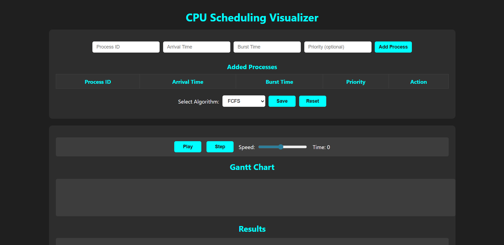

# CPU Scheduling Visualizer 🔁💻

A visual and interactive web-based simulator for popular CPU scheduling algorithms including FCFS, SJF, Priority Scheduling, and Round Robin. This tool is designed to help students and developers **understand how scheduling algorithms work** through animations and step-wise execution.

---

## 🚀 Features

- 🎯 Add custom processes with arrival time, burst time, and optional priority.
- 🧠 Simulate algorithms:
  - FCFS (First Come First Serve)
  - SJF (Shortest Job First - Non-preemptive)
  - Priority Scheduling (Non-preemptive)
  - Round Robin (with configurable time quantum)
- ⏯️ Step-by-step and auto-play simulation.
- 📊 Dynamic Gantt chart representation.
- ⚙️ Adjustable animation speed using a slider.
- 📈 Final output shows:
  - Average Waiting Time
  - Average Turnaround Time
  - Per-process details.

---

## 🛠️ How to Run

1. **Clone or download this repository**.
2. Open `index.html` in any modern browser (no server setup needed).
3. Add your processes and start simulating!

---

##Preview
